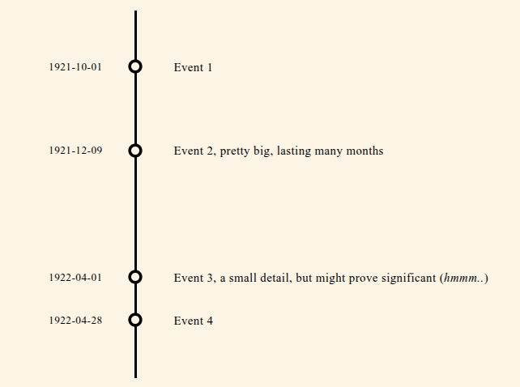

# html_vertical_timelines

Example of intended design: 

# Design Goals

There are two main goals that this project tries to aim for:

1. Self-contained and portable
   
   I wanted to create a single HTML file that contained everything it needed, with no external dependencies. The point to this is that someone may copy what you have written up and later have it be shown in the same way regardless of the new user's environment, without need to worry about collecting extra formatting files, scripting files, or scripting library files (like jQuery). Internet access is NOT assumed to be gauranteed.

    I'm allowing for an exception in that if a user refers to external URIs, for example embedding s and etc., then that's that person's choice.
   
3. Proprtionality between entries

    I also wanted this to stand out in one unique way. The different time-based entires inside should stand near or apart from each other depending on the temporal distances between them. If two events happened relatively close to each other, say in terms of days rather than years, so should they appear closer together on a timeline. If there's a relatively long period of time between two events, they should appear spread out from each other.

   This can create interesting consequences for the event data being added.

# Creating Your Own HTML Timeline

1. Download a copy of `example_concept.html`
2. Open your file with a text editor (notepad, vim, etc.)
3. Towards the top of the file, look for the `timepoint_list` variable, and add the dates and event descriptions you want.
4. Towards the bottom of the file, change the `<h1>` HTML tag to show a more appropriate title inside the page.
5. Back towards the top of the file, change the `<title>` HTML tag.
6. Save your changes.
7. Open your preferred webbrowswer, use its "File" then "Open File..." menu entries to open your `example_concept.html` file you just changed.
8. Continue making changes or additions to your `example_concept.html` file. Use your brower's Reload button or Ctrl-R to view your new changes.
9. You can choose to share your results by emailing your file to friends and family or by upload it to your favorite web provider.

# Credits and Influences

https://codepen.io/alanhouser/pen/aErrQJ 
https://codepen.io/darcyvoutt/pen/ogPrpK/

# coding notes:

grids: https://www.w3schools.com/css/css_grid.asp 
vert lines: https://www.w3schools.com/howto/howto_css_vertical_line.asp 
            https://www.delftstack.com/howto/html/html-vertical-line/ 
            https://freefrontend.com/css-timelines/ 
wavy lines: unicode "ALMOST EQUAL TO", HTML &asymp; 

   
